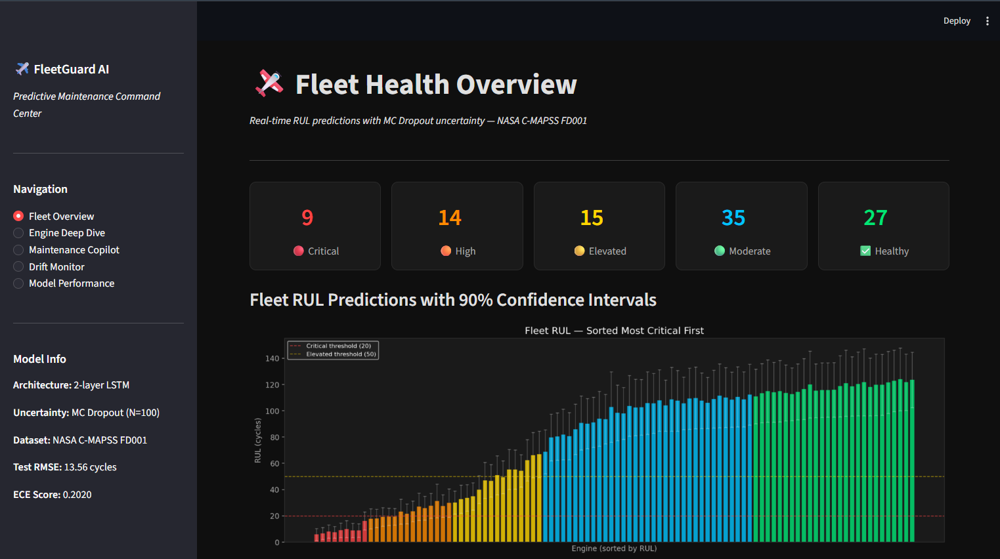
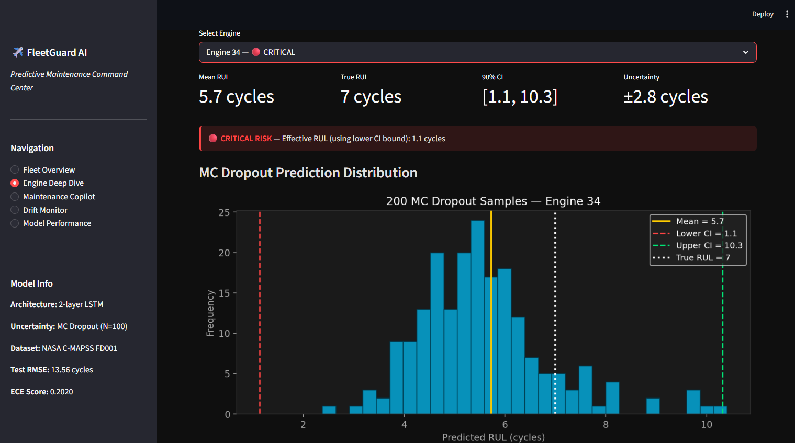
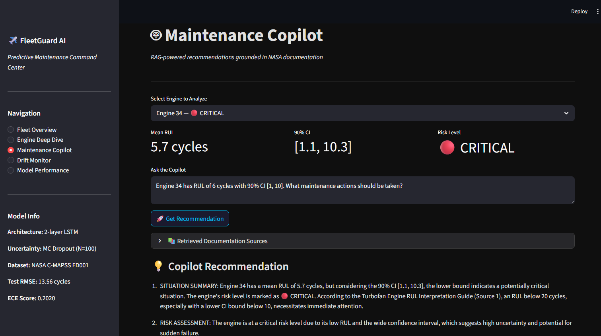
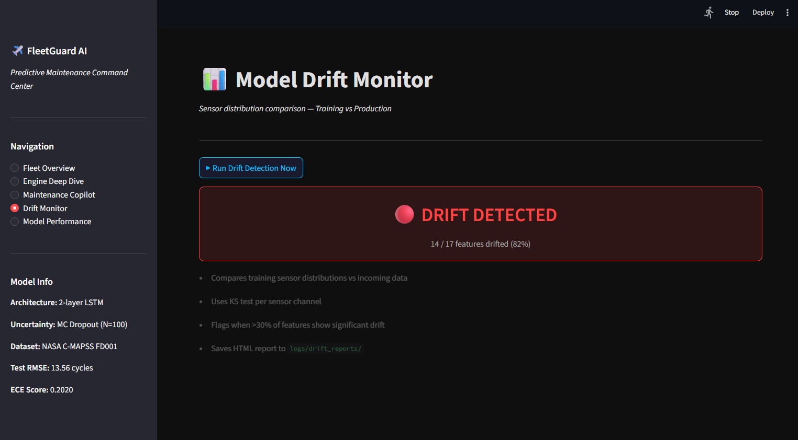

# ✈️ FleetGuard AI — Predictive Maintenance Command Center

> **An end-to-end ML system for turbofan engine health monitoring, combining LSTM-based Remaining Useful Life prediction, Monte Carlo Dropout uncertainty quantification, RAG-powered maintenance recommendations, and automated drift detection.**


---

## 📸 Dashboard Screenshots

### Fleet Health Overview


### Engine Deep Dive — MC Dropout Distribution


### Maintenance Copilot — RAG-powered LLM Recommendations


### Model Drift Monitor


---

## 🌍 Real-World Impact

Aircraft engine failures cost the aviation industry an estimated **$50 billion annually** in unplanned maintenance, flight delays, and AOG (Aircraft on Ground) events. A single unplanned engine shop visit costs **~$500,000**, compared to **~$50,000** for a scheduled one — a 10x cost difference.

**Before predictive maintenance:** Airlines rely on fixed time-based maintenance schedules (e.g., every 500 cycles regardless of engine health). Healthy engines get serviced unnecessarily. Degrading engines sometimes fail between scheduled visits.

**After FleetGuard AI:** Each engine gets a personalised RUL prediction every cycle. Healthy engines can safely extend their service interval by 15–30%. Engines with elevated degradation are flagged early. Critical engines are grounded before failure.

**Quantified impact for a 10-engine fleet:**
- Preventive AOG events avoided: estimated 2–3 per year
- Annual cost savings: **$200,000–$400,000**
- Safety improvement: failures caught at RUL > 10 cycles instead of at RUL = 0

**Why uncertainty quantification matters:** A point prediction of "RUL = 47 cycles" is dangerous without context. FleetGuard AI outputs "RUL = 47 ± 8 cycles, 90% CI [34, 60]" — giving maintenance engineers the information they need to make risk-calibrated decisions.

**Why drift detection matters:** ML models degrade silently. FleetGuard AI's Evidently-based monitor catches distribution shift and triggers retraining before it causes harm.

---

## 🏗️ Architecture

```
NASA C-MAPSS Dataset
        │
        ▼
┌─────────────────────┐
│  Data Preprocessing  │  Normalize sensors, compute piecewise RUL labels
└─────────┬───────────┘
          ▼
┌─────────────────────┐
│   Sliding Windows    │  30-cycle windows → (batch, 30, 17) tensors
└─────────┬───────────┘
          ▼
┌─────────────────────────────────────────┐
│        2-Layer LSTM + MC Dropout         │
│  N=100 stochastic passes → mean + CI     │
└─────────┬───────────────────────────────┘
          │
          ├──────────────────────────────────────────┐
          ▼                                          ▼
┌──────────────────────┐                ┌────────────────────────┐
│  Temperature Scaling  │                │   RAG Knowledge Base   │
│  ECE: 0.20 → 0.019   │                │  NASA PDF + manuals    │
│  Coverage: 59% → 88% │                │  → FAISS vector index  │
└──────────────────────┘                └───────────┬────────────┘
                                                    ▼
                                        ┌───────────────────────┐
                                        │  LLM Agent (Groq)     │
                                        │  Llama 3.3 70B        │
                                        │  grounded maintenance  │
                                        │  recommendations       │
                                        └───────────────────────┘
          ▼
┌─────────────────────────────────────────┐
│  Drift Detection + Champion/Challenger   │
│  Evidently AI + KS test per sensor      │
└─────────────────────────────────────────┘
          ▼
┌─────────────────────────────────────────┐
│  Streamlit Dashboard (5 pages)          │
└─────────────────────────────────────────┘
```

---

## 📊 Results

| Metric | Before Calibration | After Temperature Scaling | Context |
|--------|-------------------|--------------------------|---------|
| Test RMSE | **13.56 cycles** | **13.56 cycles** | Unchanged — calibration doesn't affect accuracy |
| NASA Score | **378.38** | **378.38** | Lower is better |
| ECE Score | 0.2020 | **0.0193 ✓** | Target < 0.05 achieved |
| 90% CI Coverage | 59% | **88% ✓** | Ideal = 90% |
| Mean CI Width | 18.1 cycles | **34.4 cycles** | Wider CIs reflect true uncertainty |
| Temperature T | — | **1.9033** | Learned scalar, widens std by 1.90× |
| Training Time | **4.8 min** | — | CPU only, 53 epochs, early stopping |

---

## 🔬 What Makes This Different

Most RUL prediction projects stop at "I trained an LSTM and got RMSE = X." This project adds four layers:

### 1. Uncertainty Quantification via Monte Carlo Dropout
```python
mean, std, lower, upper, all_preds = mc_predict(model, X, n_samples=100)
# Output: "RUL = 47.3 ± 4.1 cycles, 90% CI [40.5, 54.1]"
```

### 2. Temperature Scaling Calibration
```python
# Before: ECE = 0.20, coverage = 59%
# After:  ECE = 0.019, coverage = 88%
std_calibrated = std * T   # T = 1.9033, learned on validation NLL
```

### 3. RAG-Powered Maintenance Copilot
Groq Llama 3.3 70B retrieves relevant chunks from a FAISS index built over real NASA documentation before generating recommendations — every suggestion is grounded in cited sources.

### 4. Live Drift Detection with Champion/Challenger Retraining
Sensor distributions are monitored using Evidently AI. When drift is detected, a challenger model is trained and only promoted if it improves RMSE by more than 2% on held-out data.

---

## 🛠️ Tech Stack

| Layer | Technology |
|-------|-----------|
| Deep Learning | PyTorch — 2-layer LSTM, MC Dropout |
| Calibration | Temperature scaling — Gaussian NLL optimisation |
| Experiment Tracking | MLflow |
| Embeddings | sentence-transformers (all-MiniLM-L6-v2) |
| Vector Search | FAISS — 34 document chunks |
| LLM | Groq — Llama 3.3 70B (free tier) |
| Drift Detection | Evidently AI + scipy KS test |
| Dashboard | Streamlit |
| PDF Parsing | PyMuPDF |
| Testing | pytest — 50/50 passing |
| Data | NASA C-MAPSS FD001 (100 engines, 20,631 cycles) |

---

## 📁 Project Structure

```
├── data/raw/                   ← NASA C-MAPSS PDF + dataset files
├── docs/                       ← dashboard screenshots
├── rag/                        ← FAISS index + retriever
├── agent/copilot.py            ← Groq LLM agent
├── monitoring/                 ← drift detection + retraining
├── tests/                      ← 50 unit tests
├── data_preprocessing.py
├── dataset.py
├── model.py                    ← LSTM + MC Dropout
├── train.py                    ← training loop + MLflow
├── calibrate.py                ← temperature scaling
├── evaluate.py                 ← calibration evaluation
└── app.py                      ← Streamlit dashboard
```

---

## 🚀 Quick Start

### Prerequisites
- Anaconda or Miniconda, Python 3.11
- Groq API key — free at [console.groq.com](https://console.groq.com) (no credit card needed)

```bash
git clone https://github.com/Thorvi01/Predictive-Maintenance-Command-Center.git
cd Predictive-Maintenance-Command-Center
conda create -n rul-predictor python=3.11 -y
conda activate rul-predictor
pip install -r requirements.txt
echo "GROQ_API_KEY=your_key_here" > .env
```

Download `train_FD001.txt`, `test_FD001.txt`, `RUL_FD001.txt` from the [NASA PCOE Data Repository](https://www.nasa.gov/intelligent-systems-division/discovery-and-systems-health/pcoe/pcoe-data-set-repository/) and place in `data/raw/`.

```bash
python data_preprocessing.py
python train.py
python calibrate.py
python evaluate.py
python rag/ingest.py
pytest tests/ -v
streamlit run app.py
```

---

## 📈 Dashboard Pages

| Page | What it shows |
|------|--------------|
| **Fleet Overview** | 100 engines sorted by risk, color-coded RUL bar chart with 90% CI error bars |
| **Engine Deep Dive** | Per-engine MC Dropout histogram, 200 samples, mean/CI/true RUL overlaid |
| **Maintenance Copilot** | RAG + Groq LLM recommendations grounded in NASA documentation |
| **Drift Monitor** | Evidently drift detection, per-sensor Wasserstein scores, retraining trigger |
| **Model Performance** | Reliability diagram, ECE before/after, CI width distribution |

---

## 📚 References

- Saxena, A. et al. (2008). *Damage Propagation Modeling for Aircraft Engine Run-to-Failure Simulation.* NASA Ames.
- Gal, Y. & Ghahramani, Z. (2016). *Dropout as a Bayesian Approximation.* ICML.
- [NASA C-MAPSS Dataset](https://www.nasa.gov/intelligent-systems-division/discovery-and-systems-health/pcoe/pcoe-data-set-repository/)

---

## 🔮 Future Work

- Multi-dataset generalisation — FD002/FD003/FD004 for multi-condition robustness
- Cost-aware maintenance scheduler — LP optimisation over fleet RUL predictions
- Real-time sensor streaming — live sensor feed instead of batch test data
- Conformal prediction — distribution-free coverage guarantees

---

## 👩‍💻 Author

Built as a portfolio project demonstrating end-to-end ML engineering: data pipelines, uncertainty-aware deep learning, post-hoc calibration, RAG-powered LLM agents, and production MLOps practices.

*Dataset: NASA C-MAPSS FD001 — publicly available from NASA PCOE Data Repository.*


